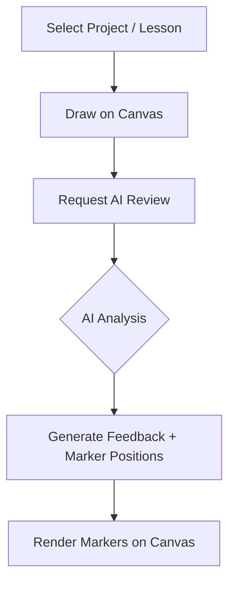

# Canvas Critique

A desktop application for practicing handwritten exercises. It uses AI models like Gemini and OpenRouter to analyze drawings and place feedback markers directly on the canvas.

## What It Is

**Canvas Critique** is a desktop app for practicing handwriting, calligraphy, or other stroke-based exercises on a digital canvas.

The basic idea is simple:  
You draw on the canvas, send your work to an AI model, and receive feedback directly on the page.

The AI can check things like stroke position, proportions, angles, spacing, or other task-specific rules depending on how the lesson is configured.

## Features

* **Drawing Canvas**
  * Supports both fixed **A4 pages** and an **Infinite Canvas**
  * Optional guide overlays (grid lines, baselines, slants, trace templates)
  * Adjustable background and guideline visibility

* **AI Evaluation**
  * Sends drawings to AI models for analysis
  * Returns text feedback and a score
  * Places visual feedback markers directly on the canvas

* **Projects & Lessons**
  * Organize exercises into projects and lessons
  * Each lesson can contain its own tasks and instructions
  * Custom AI settings can be configured per lesson

* **Task Editor**
  * Create tasks with instructions and reference images
  * Add trace templates or example solutions
  * Supports drag & drop and clipboard image pasting

* **Additional Tools**
  * Usage statistics
  * API token/cost tracking
  * Light and dark mode
 
## LLM Model Choice
It is necessary to choose an LLM model with vision capabilities. I found that `Gemini 3 Flash` is fast and good enough for the job at the current date (26.06.2026).

If you choose an LLM model that is too weak, it could happen, for example, that the markers on the canvas are offset.

## Gallery & Interface Placeholders

Below are placeholders for screenshots of the application.

### Main Dashboard


### Practice Canvas


### AI Feedback & Visual Markers


### Lesson Creator


### Task Editor


## How It Works



### 1. Draw

Open a lesson and complete the task by drawing directly on the canvas using a mouse or drawing tablet.

Optional guides or background templates can be enabled depending on the exercise.

### 2. Send for Review

After finishing, click **Check Work**.

The application collects the drawing data together with task instructions, lesson settings, and optional reference images.

This data is then sent to the configured AI API.

### 3. Review Feedback

The AI returns text feedback, a score, and marker positions.

These markers are drawn directly on the canvas.

Each marker contains feedback for a specific part of the drawing (for example incorrect angle, wrong height, bad alignment, etc.).

## WSL Development & Windows Build Guide

To develop this project inside WSL (Windows Subsystem for Linux) and compile it into a native Windows executable (`.exe`), follow this guide.

### Prerequisites (WSL)

Run the following commands inside your WSL terminal to set up the build tools:

1. **Install Node.js & npm:**
   Ensure you have Node.js (LTS version recommended) and npm installed.

2. **Install Rust:**
   Install Rust via rustup if you haven't already:
   ```bash
   curl --proto '=https' --tlsv1.2 -sSf https://sh.rustup.rs | sh
   source $HOME/.cargo/env
   ```

3. **Install Debian Packages:**
   Install the required cross-compilation packages (`clang`, `lld`, and optionally `nsis` to build the setup installer):
   ```bash
   sudo apt update
   sudo apt install -y lld clang nsis
   ```

4. **Add the Windows MSVC Target to Rust:**
   ```bash
   rustup target add x86_64-pc-windows-msvc
   ```

5. **Install `cargo-xwin`:**
   Installs the tool that fetches and configures the Windows SDK headers:
   ```bash
   cargo install --locked cargo-xwin
   ```

6. **Link the LLVM Resource Compiler:**
   Tauri relies on `llvm-rc` to compile Windows resource files. Link your versioned LLVM resource compiler into Cargo's binary path:
   ```bash
   ln -sf /usr/bin/llvm-rc-18 $HOME/.cargo/bin/llvm-rc
   ```

### Commands

This project includes a `Makefile` to quickly run commands:

* **Start the development server:**
  ```bash
  make dev
  ```

* **Build the Windows Application (.exe):**
  ```bash
  make build
  ```

* **Clean build output files:**
  ```bash
  make clean
  ```

* **Perform a deep clean (including node_modules):**
  ```bash
  make clean-all
  ```

### Where to Find the Build Artifacts

After running `make build`, the outputs are located at:

* **Raw Standalone Executable (`canvascritique.exe`):**
  `src-tauri/target/x86_64-pc-windows-msvc/release/canvascritique.exe`  
  *(You can run this `.exe` directly on your Windows host by navigating to `<project-folder>\src-tauri\target\x86_64-pc-windows-msvc\release\` inside your WSL file share)*

* **Setup Installer (`CanvasCritique_<version>_x64-setup.exe`):**
  `src-tauri/target/x86_64-pc-windows-msvc/release/bundle/nsis/`

---

> [!NOTE]  
> This project code was co-written using **Antigravity** (AI coding assistant by Google DeepMind) and manually verified and tested.
> So this project was not created to program but to get the product.
