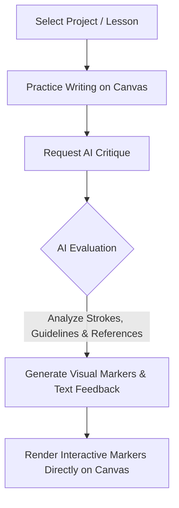

# CanvasCritique

A beautiful, feature-rich desktop application for practicing calligraphy and handwriting, built using Svelte 5, Vite, and Tauri v2. CanvasCritique integrates with Gemini AI to provide real-time, interactive visual feedback directly on your drawing canvas.

---

<!-- Placeholder for Application Banner / Screenshot -->
> [!TIP]
> **[Placeholder: Add Application Main Banner or Overview Image Here]**
<!-- [IMAGE: /path/to/main_banner.png] -->

---

## What It Is

**CanvasCritique** is a modern desktop application that bridges the gap between traditional handwriting practice and digital feedback. Built for students, calligraphy enthusiasts, and language learners, it lets you practice strokes on a digital canvas and receive targeted, visual, and qualitative critique from state-of-the-art AI models.

No more guessing if your stroke order, angle, height, or proportions are correct. With CanvasCritique, you get immediate guidance and visual correction markers, right on the page.

---

## Key Features

* **Interactive Practice Canvas:**
  * Support for both structured **A4 Page layouts** and an **Infinite Canvas**.
  * Custom grid patterns, baseline grids, slant lines, and trace templates.
  * Real-time adjustment of template guidelines and background opacity.
* **AI-Powered Evaluation:**
  * Detailed grading and qualitative feedback on your calligraphy practices.
  * Visual correction markers (Correct, Incorrect, Partial) placed at precise coordinates on your canvas.
  * Custom system prompts and fine-tuned settings to control the evaluation details.
* **Lesson & Project Management:**
  * Organize your practice into logical learning paths (Projects) and modules (Lessons).
  * Configure individual task objectives, trace guides, and solution assets.
  * Enable lesson-specific setting overrides for tailored AI evaluations.
* **Rich Task Editor:**
  * Add task instructions, guidelines, and reference solution templates.
  * Drag-and-drop support for media files and clipboard image pasting.
* **Aesthetics & Customization:**
  * Sleek user interface with full light and dark mode compatibility.
  * Comprehensive usage statistics, token counts, and API call cost estimation.

---

## How It Works



### 1. Practice and Draw
Select a lesson, read the instructions, and write directly on the canvas using your drawing tablet or mouse. You can toggle guide overlays (such as baseline grids, slants, or standard guidelines) or trace over background reference images.

### 2. Request Critique
When you are ready, click the **Check Work** button. The application extracts the bounding boxes of your drawings, bundles them with the lesson guidelines, reference solution images, and task text, and sends them to the configured AI API (such as Gemini 1.5 Flash).

### 3. Review Visual Annotations
The AI analyzes your strokes against the guidelines and solutions. It returns general text feedback, a score, and a list of specific coordinates with feedback annotations. CanvasCritique draws these markers directly onto your canvas. Hovering over a marker reveals the critique (e.g., "Stroke is too high," "Excellent entry angle").

---

## Gallery & Interface Placeholders

Below are placeholders to showcase the core user interface of the application:

### Main Dashboard
> [!NOTE]  
> **[Placeholder: Add Main Dashboard / Projects List Image Here]**
<!-- [IMAGE: /path/to/dashboard.png] -->

### Interactive Practice Canvas
> [!NOTE]  
> **[Placeholder: Add Practice Canvas with Drawing & Guidelines Image Here]**
<!-- [IMAGE: /path/to/practice_canvas.png] -->

### AI Feedback & Visual Markers
> [!NOTE]  
> **[Placeholder: Add Drawing with Visual AI Feedback Markers Image Here]**
<!-- [IMAGE: /path/to/ai_feedback.png] -->

### Task Editor & Lesson Creator
> [!NOTE]  
> **[Placeholder: Add Task Editor with Media Uploads Image Here]**
<!-- [IMAGE: /path/to/task_editor.png] -->

---

## WSL Development & Windows Build Guide

To develop this project inside WSL (Windows Subsystem for Linux) and compile it into a native Windows executable (`.exe`), follow this guide.

### Prerequisites (WSL)

Run the following commands inside your WSL terminal to set up the build tools:

1. **Install Node.js & npm:**
   Ensure you have Node.js (LTS version recommended) and npm installed.

2. **Install Rust:**
   Install Rust via rustup if you haven't already:
   ```bash
   curl --proto '=https' --tlsv1.2 -sSf https://sh.rustup.rs | sh
   source $HOME/.cargo/env
   ```

3. **Install Debian Packages:**
   Install the required cross-compilation packages (`clang`, `lld`, and optionally `nsis` to build the setup installer):
   ```bash
   sudo apt update
   sudo apt install -y lld clang nsis
   ```

4. **Add the Windows MSVC Target to Rust:**
   ```bash
   rustup target add x86_64-pc-windows-msvc
   ```

5. **Install `cargo-xwin`:**
   Installs the tool that fetches and configures the Windows SDK headers:
   ```bash
   cargo install --locked cargo-xwin
   ```

6. **Link the LLVM Resource Compiler:**
   Tauri relies on `llvm-rc` to compile Windows resource files. Link your versioned LLVM resource compiler into Cargo's binary path:
   ```bash
   ln -sf /usr/bin/llvm-rc-18 $HOME/.cargo/bin/llvm-rc
   ```

### Commands

This project includes a `Makefile` to quickly run commands:

* **Start the development server:**
  ```bash
  make dev
  ```

* **Build the Windows Application (.exe):**
  ```bash
  make build
  ```

* **Clean build output files:**
  ```bash
  make clean
  ```

* **Perform a deep clean (including node_modules):**
  ```bash
  make clean-all
  ```

### Where to Find the Build Artifacts

After running `make build`, the outputs are located at:

* **Raw Standalone Executable (`canvascritique.exe`):**
  `src-tauri/target/x86_64-pc-windows-msvc/release/canvascritique.exe`  
  *(You can run this `.exe` directly on your Windows host by navigating to `<project-folder>\src-tauri\target\x86_64-pc-windows-msvc\release\` inside your WSL file share)*

* **Setup Installer (`CanvasCritique_<version>_x64-setup.exe`):**
  `src-tauri/target/x86_64-pc-windows-msvc/release/bundle/nsis/`

---

> [!NOTE]  
> This project code was co-written using **Antigravity** (AI coding assistant by Google DeepMind) and manually verified and tested.
